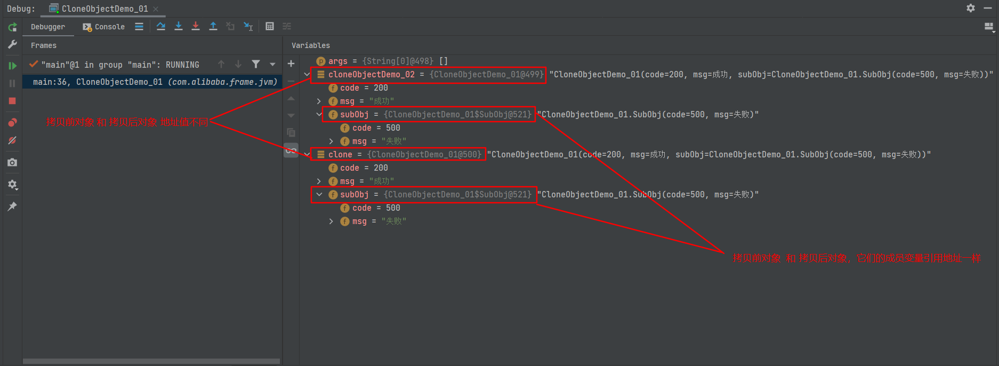
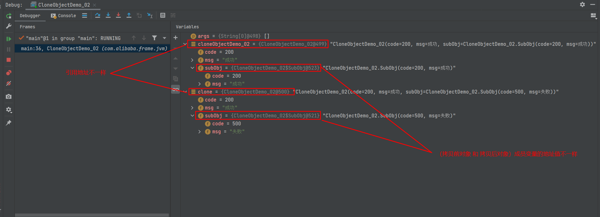

# 前言

<font face="幼圆">

> 对象的浅拷贝 和 深拷贝

</font>

# 对象的浅拷贝

```java 
package com.alibaba.frame.jvm;
import lombok.Data;

/**
 * @projectName: frame
 * @packageName: com.alibaba.frame.jvm
 * @className: CloneObjectDemo_01
 * @description: 对象浅拷贝
 * @author: admin
 * @date: 2023-07-11
 * @version: 1.0
 */
@Data
public class CloneObjectDemo_01 implements Cloneable {
	private int code = 200;
	private String msg = "成功";
	private SubObj subObj;


	public static void main(String[] args) throws Exception {

		// 深拷贝前对象
		CloneObjectDemo_01 cloneObjectDemo_02 = new CloneObjectDemo_01();
		cloneObjectDemo_02.setSubObj(new SubObj());
		System.out.println(cloneObjectDemo_02.hashCode());
		System.out.println(cloneObjectDemo_02 + "\n");


		// 深拷贝后对象
		CloneObjectDemo_01 clone = (CloneObjectDemo_01) cloneObjectDemo_02.clone();
		clone.getSubObj().setCode(500);
		clone.getSubObj().setMsg("失败");
		System.out.println(clone.hashCode());
		System.out.println(clone + "\n");

	}


	/**
	 * Object的clone()方法是浅拷贝，如果成员变量是引用类型（除String以外），那么该成员变量拷贝的是引用地址；
	 * 现象就是拷贝前对象的成员变量 与 拷贝后对象的成员变量引用地址一样，修改成员变量里的内容会影响到另一个拷贝对象的成员变量的内容
	 *
	 * @return
	 * @throws CloneNotSupportedException
	 */
	@Override
	protected Object clone() throws CloneNotSupportedException {
		return super.clone();
	}

	@Data
	static class SubObj implements Cloneable {
		private int code = 200;
		private String msg = "成功";

		@Override
		protected Object clone() throws CloneNotSupportedException {
			return super.clone();
		}
	}
}
```

# 对象的浅拷贝（观察运行时栈帧中局部变量表中变量情况）

<font face="幼圆">

> 分析：对象浅拷贝时候，（除字符串以外的引用类型）成员变量拷贝；拷贝前对象 与 拷贝后对象的成员变量
> 引用地址一样；
>
> 导致问题出现：如果改动对象（拷贝前对象 或 拷贝后对象）的成员变量的对象内容，
> 就会改动另一个（拷贝前对象 或 拷贝后对象）的成员变量内容，因为他们的成员变量引用地址一样

</font>



# 对象深拷贝

```java 
package com.alibaba.frame.jvm;
import lombok.Data;

/**
 * @projectName: frame
 * @packageName: com.alibaba.frame.jvm
 * @className: CloneObjectDemo_02
 * @description: 对象深拷贝
 * @author: admin
 * @date: 2023-07-11
 * @version: 1.0
 */
@Data
public class CloneObjectDemo_02 implements Cloneable {
	private int code = 200;
	private String msg = "成功";
	private SubObj subObj;


	public static void main(String[] args) throws Exception {

		// 深拷贝前对象
		CloneObjectDemo_02 cloneObjectDemo_02 = new CloneObjectDemo_02();
		cloneObjectDemo_02.setSubObj(new SubObj());
		System.out.println(cloneObjectDemo_02.hashCode());
		System.out.println(cloneObjectDemo_02 + "\n");


		// 深拷贝后对象
		CloneObjectDemo_02 clone = (CloneObjectDemo_02) cloneObjectDemo_02.clone();
		clone.getSubObj().setCode(500);
		clone.getSubObj().setMsg("失败");
		System.out.println(clone.hashCode());
		System.out.println(clone + "\n");
	}


	/**
	 *重写clone()方法，实现深拷贝
	 * 
	 * @return
	 * @throws CloneNotSupportedException
	 */
	@Override
	protected Object clone() throws CloneNotSupportedException {
		// 浅拷贝对象
		CloneObjectDemo_02 clone = (CloneObjectDemo_02) super.clone();

		// 获取拷贝后的（除字符串之外的引用类型的对象）成员变量
		SubObj subObj = clone.getSubObj();

		// 1. 浅拷贝成员变量，得到一个新地址值的对象
		// 2. 浅拷贝对象设置新地址值的成员变量
		// 3. 结果操作新拷贝对象的成员变量 就不会影响到拷贝前对象的成员变量了，因为成员变量的引用地址不一样了
		clone.setSubObj((SubObj) subObj.clone());
		return clone;
	}

	@Data
	static class SubObj implements Cloneable {
		private int code = 200;
		private String msg = "成功";

		@Override
		protected Object clone() throws CloneNotSupportedException {
			return super.clone();
		}
	}
}
```

# 对象的深拷贝（观察运行时栈帧中局部变量表中变量情况）

<font face="幼圆">

> 分析：对象深拷贝时候，（除字符串以外的引用类型）成员变量拷贝；拷贝前对象 与 拷贝后对象的成员变量
> 引用地址不一样；
>
> 结论：如果改动对象（拷贝前对象 或 拷贝后对象）的成员变量的对象内容，
> 就不会改动另一个（拷贝前对象 或 拷贝后对象）的成员变量内容，因为他们的成员变量引用地址不一样

</font>




